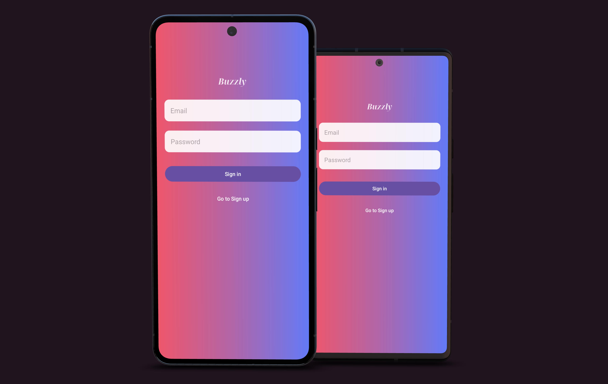

# Buzzly
*A simple real-time chat application built with Android & Firebase*



## Overview
Buzzly is a lightweight Android chat application that allows authenticated users to see other users, start private chats, and exchange real-time messages.

The project focuses on:
- Clean architecture
- Real-time communication
- Maintainable UI resources
- Clear separation of concerns using MVVM

The UI was designed freely without strict adherence to a Figma prototype, allowing exploration and iteration during development.


## Core Features
- 🔐 User authentication (Sign up / Sign in)
- 👤 User profiles stored in Firestore
- 👥 List of available users
- 💬 One-to-one chat rooms
- 🔄 Real-time messaging using Firestore listeners
- 📱 Clean and consistent UI using shared resources (colors, dimens, styles)

## Architecture
Buzzly follows a **MVVM architecture** combined with a **Repository pattern**.

### Layers
- **UI (Activities & Fragments)**  
  Handles user interaction and observes ViewModels.
- **ViewModels**  
  Holds UI state using LiveData and communicates with repositories.
- **Repositories**  
  Encapsulate Firebase logic (Auth & Firestore).
- **Data models**  
  Simple Kotlin data classes (`User`, `Message`).

This structure keeps Activities and Fragments lightweight and easy to test and maintain.

## Firebase Structure
Firestore collections used:
  ```
users
└── {userId}
├── uid
├── email
└── displayName

chatRooms
└── {chatId}
├── participants: [uid1, uid2]
├── createdAt
└── messages
└── {messageId}
├── text
├── senderId
├── senderName
└── timestamp
  ```

Chat IDs are generated deterministically so the same two users always share the same chat room.

## UI & Resource Management
To improve consistency and maintainability, all hardcoded values were replaced with shared resources:

- **colors.xml** – brand colors, surfaces, text colors
- **dimens.xml** – spacing, text sizes, corner radii, touch targets
- **strings.xml** – all visible text and placeholders
- **styles.xml** – shared text styles (e.g. auth logo)

This makes the UI:
- Easier to adjust globally
- Ready for localization
- More readable and scalable

## Navigation Flow
1. **Sign In / Sign Up**
2. **Profile screen**
    - Displays current user
    - Lists other users
3. **Chat Room**
    - Real-time messages
    - Separate layouts for sent and received messages
4. **Sign Out**
    - Clears session and returns to sign-in

## Technologies Used

- Kotlin
- Android SDK
- Firebase Authentication
- Firebase Firestore
- ViewModel & LiveData
- ViewBinding
- RecyclerView
- XML layouts & custom drawables

## Setup & Installation
1. Clone the repository:

   ```
   git clone https://github.com/your-username/buzzly.git

3.	Open the project in Android Studio
4.	Let Gradle sync
5.	Run the app on an emulator or physical device

## Requirements
-	Min SDK: API 21
-	Target SDK: API 34
-	Firebase project configured

## Current Limitations
- No group chats
- No message read receipts
- No profile image upload
- No offline support

## Possible Future Improvements
- Group chats
- Message status indicators (seen / delivered)
- User avatars
- Push notifications
- Search users
- Message reactions


   